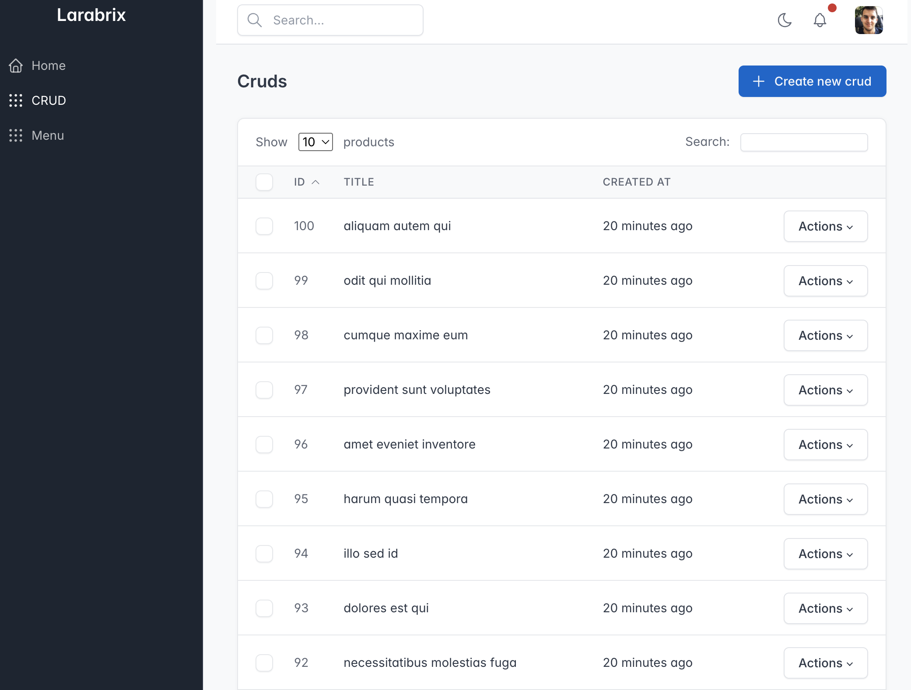
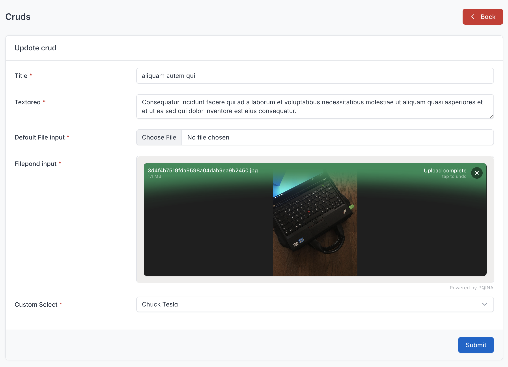
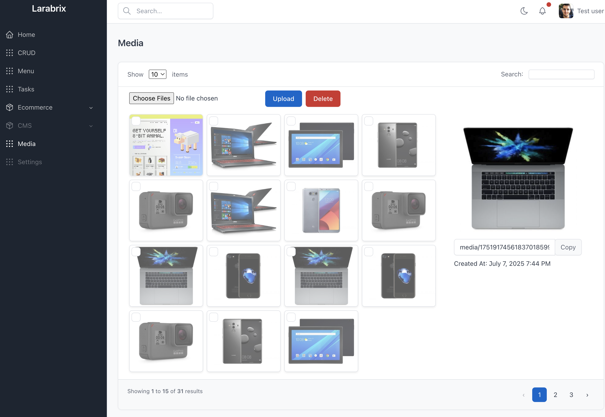
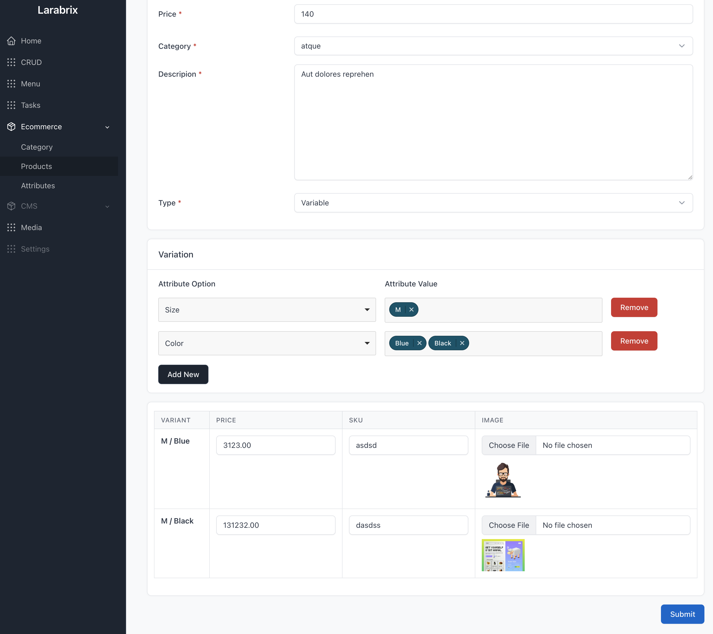
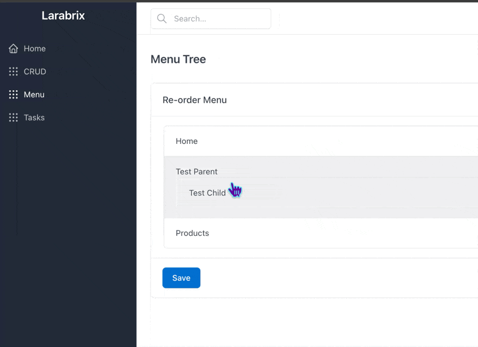
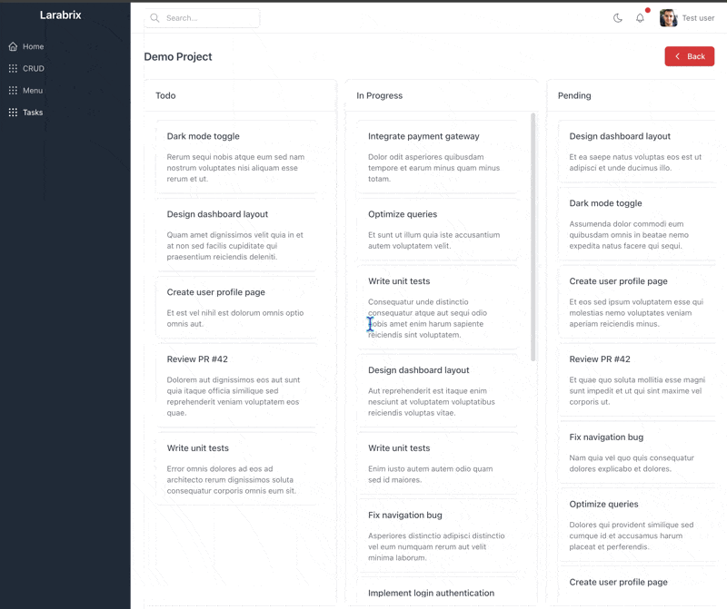

# Larabrix

**Larabrix** is a modular Laravel starter kit based on Tabler UI (v1.4.0) that helps you skip the boring parts of web development. It gives you ready-made building blocks — like product management, media uploads, menus, and task boards — so you can focus on building your app instead of repeating the same setup over and over.

> ⚠️ Larabrix is currently under development. Modules will be released incrementally.

---

## 📚 Table of Contents

- [Upcoming Features](#-upcoming-features)
- [Screenshots](#-screenshots)
- [License](#-license)

---

## 🚀 Upcoming Features

| ✔️ | Feature                                      | Priority | ETA       |
|----|----------------------------------------------|----------|-----------|
| 🔄 | Authentication                               | High     | Q3 2025    |
| ✅ | Common CRUD module                           | High     | ✅ Done    |
| ✅ | Dynamic Menu Management                      | High     | ✅ Done    |
| ✅ | Kanban Task Manager                          | High     | ✅ Done    |
| ✅ | Product & Category Management                | High     | Q3 2025    |
| ✅ | Custom Form builder                          | Medium   | ✅ Done    |
| ✅ | Media Library (upload & manage)              | High     | ✅ Done    |
| ✅ | Blog / Posts with Categories & Tags          | Low      | Q3 2025    |
| ✅ | CMS (Page Builder / Static Pages)            | Medium   | Q4 2025    |
| ✅ | Custom CMS (Markdown / WYSIWIG / DnD)        | Medium   | Q4 2025    |
| 🔄 | Payment Gateway Management                   | High     | Q4 2025    |
| 🔄 | Additional E-commerce (Cart, Payment, etc.)  | High     | Q4 2025    |
| ❌ | Global Settings Panel                        | Medium   | Q3 2025    |
| ❌ | Dashboard Widgets / Analytics Cards          | Medium   | Q3 2025    |
| ❌ | Import/Export CSV for CRUD                   | Medium   | Q3 2025    |
| ❌ | Basic API Setup with Token Auth              | Low      | Q4 2025    |
| ❌ | Reports Management                           | Medium   | Q4 2025    |
| ❌ | Support Ticket Module                        | Low      | Q4 2025    |
| ❌ | Notification Center                          | Low      | Q4 2025    |

---

## 📸 Screenshots

Stay tuned — more modules are cooking. 🍳  

**Some Dummy Screenshots:**

**CRUD Index**

**CRUD Update**

**Media Gallery**

**Product Variants**

**Sorting Menu**

**Kanban Task Manager**

---

## 📄 License

Larabrix is open-sourced under the [MIT license](LICENSE).
